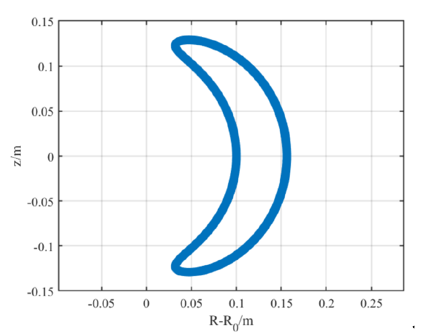
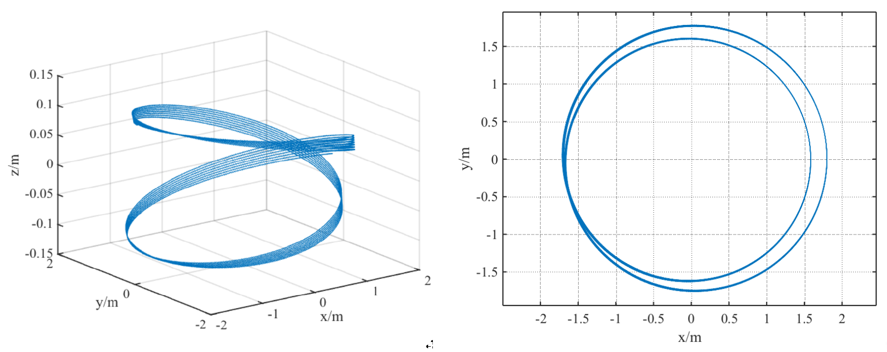
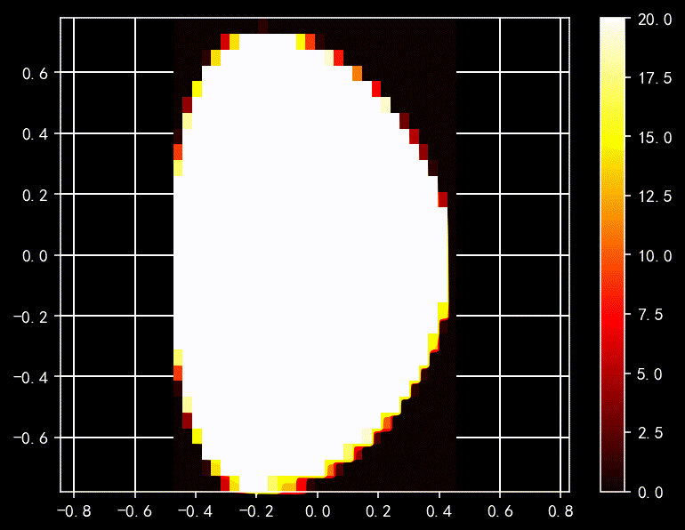
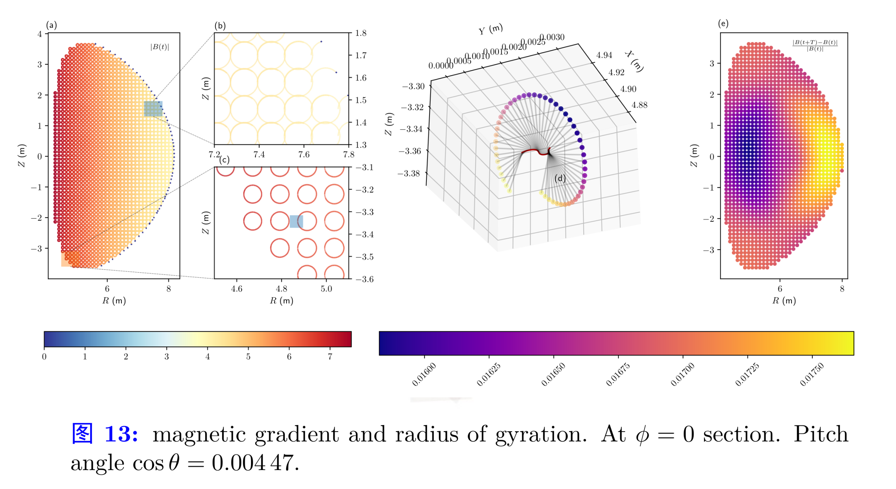

## Tokamak fields

$$
\mathbf{B} = \boldsymbol{\nabla} \xi + \frac{r^2}{qR} \boldsymbol{\nabla}\theta
$$
where $q$ is safety factor.


$\require{physics}$


Jacobian:
$$
  J = \grad \xi^1 \vdot \grad \xi^2 \cross \grad \xi^3 = \frac{1}{\sqrt{g}}
$$

Gradient:
$$
    \grad = \grad \xi^i \pdv{\xi^i}
$$

Divergence:
$$
  \div \vb{A} = \frac{1}{\sqrt{g}} \pdv{\xi^i} ( A^i \sqrt{g} )
$$

Curl:  
If $\vb{B} = \curl \vb{A}$ then
$$
B^i =  \frac{1}{\sqrt{g}} \epsilon^{ijk} \pdv{A_k}{\xi^j}
$$


$$
  \sin \zeta = -\frac{y}{R} \quad \cos \zeta = \frac{x}{R}
$$

{{< texd `\begin{aligned}
  \vu{\zeta} = -\sin \zeta \vu{x} - \cos \zeta \vu{y}, \\
  \vu{\theta} = - \sin \theta \vu{R} + \cos \theta \vu{z}\\
  \vu{R} = \cos \zeta \vu{x} - \sin \zeta \vu{y}.
\end{aligned}` >}}

From the above equations, it can be concluded that
$$
\vu{\theta} = - \sin \theta \cos \zeta \vu{x} + \sin \theta \sin \zeta \vu{y} + \cos \theta \vu{z}.
$$


## Relativistic volume-preserving algorithms

Relativistic volume-preserving algorithms [implement](https://github.com/junyixu/ParticleTracer/blob/ce954f6d57de92f9bddef67a0301a94fe010b4a3/src/Pushers.jl#L58) in Julia.

By expanding the phase space to include the time $t$, Ref.[28] give a more general construction of volume-preserving methods that can be applied to systems with time-dependent electromagnetic fields.

We consider the most general case in which the electromagnetic fields are time-dependent.
To apply the splitting
and processing technique, we introduce $\sigma = t$ as a new
dependent variable, then it follows from Eq.(1) that
$$\frac { d } { d t } \left( \begin{array} { l } \mathbf { x } \\ \mathbf { p } \\ \sigma \end{array} \right) = \left( \begin{array} { c } \frac { 1 } { m _ { 0 } \gamma ( p ) } \mathbf { p } \\ q \mathbf { E } ( \mathbf { x } , \sigma ) + \frac { q } { m _ { 0 } \gamma ( p ) } \mathbf { p } \times \mathbf { B } ( \mathbf { x } , \sigma ) \end{array} \right)$$
From Eq.(22), it can be seen that with the coordinate
$(\mathbf{x}, \mathbf{p}, \sigma)$, the system Eq. (1)
becomes an autonomous system which are defined in an expanded space
$\mathbb { R } ^ { 3 } \times \mathbb { R } ^ { 3 } \times \mathbb { R }$(See Ref.[27] for more details). 
Because the system Eq.(1) is source-free, the exact solution is volume-preserving.<sup>[14]</sup>
Notice that for any map
$\Psi:(\mathbf{x}, \mathbf{p},\sigma) \mapsto ( \mathbf { X } , \mathbf { P } , \Sigma )$,
if $\partial \Sigma / \partial \mathbf{x} = \partial \Sigma / \partial \mathbf{p} = \mathbf{0}, \partial \Sigma / \partial \sigma = 1$,
then its Jacobian satisfied
$$\operatorname { det } \left( \frac { \partial ( \mathbf { X } , \mathbf { P } , \Sigma ) } { \partial ( \mathbf { x } , \mathbf { p } , \sigma ) } \right) = \operatorname { det } \left( \frac { \partial ( \mathbf { X } , \mathbf { P } ) } { \partial ( \mathbf { x } , \mathbf { p } ) } \right).$$
Therefore, as long as the appended variable $\sigma$ solves
$\dot{\sigma} = \text{const}$, the expanded system (2) inherits the volume-
preserving nature of the system (1). Similarly, the volume-
preserving methods for the source-free system (2) in the
expanded space also preserve the volume of phase space (x, p).
This gives us a hint on how to split the system.

It is observed that the system (2) can be decomposed as
three source-free solvable subsystems
$$\begin{aligned} \frac { d } { d t } \left( \begin{array} { l } \mathbf { x } \\ \mathbf { p } \\ \sigma \end{array} \right) = & \left( \begin{array} { c } \frac { 1 } { m _ { 0 } \gamma ( p ) } \mathbf { p } \\ 0 \\ 1 \end{array} \right) + \left( \begin{array} { c } 0 \\ q \mathbf { E } ( \mathbf { x } , \sigma ) \\ 0 \end{array} \right) \\ & + \left( \begin{array} { c } \frac { q } { m _ { 0 } \gamma ( p ) } \mathbf { p } \times \mathbf { B } ( \mathbf { x } , \sigma ) \\ 0 \end{array} \right) \\ & = F _ { 1 } ( \mathbf { x } , \mathbf { p } , t ) + F _ { 2 } ( \mathbf { x } , \mathbf { p } , t ) + F _ { 3 } ( \mathbf { x } , \mathbf { p } , t ) \end{aligned}$$
The first subsystems with $F_1$ and $F_2$ can be solved exactly
by a translational transformation as
$$\phi _ { h } ^ { F _ { 1 } } : \left\{ \begin{array} { l } \mathbf { x } ( t + h ) = \mathbf { x } ( t ) + h \frac { \mathbf { p } ( t ) } { m _ { 0 } \gamma ( p ( t ) ) } \\ \mathbf { p } ( t + h ) = \mathbf { p } ( t ) \\ \sigma ( t + h ) = \sigma ( t ) + h \end{array} \right.$$
$$\phi _ { h } ^ { F _ { 2 } } : \left\{ \begin{array} { l } \mathbf { x } ( t + h ) = \mathbf { x } ( t ) \\ \mathbf { p } ( t + h ) = \mathbf { p } ( t ) + h q \mathbf { E } ( \mathbf { x } ( t ) , \sigma ( t ) ) \\ \sigma ( t + h ) = \sigma ( t ) \end{array} \right.$$
Here, the mappings $\phi_h^{F_i}, i = 1,2,3$ denote the $h$-time step updating.
When the third subsystem is considered, it is noticed that
$p^2 = \mathbf{p}^T \mathbf{p}$ is invariant along the exact solution flow,
and therefore , so is $\gamma(p$.
Thus, the updating map $\phi_h^{F_3}$ of the exact solution can be calculated as
$$\phi _ { h } ^ { F _ { 3 } } : \left\{ \begin{array} { l } \mathbf { x } ( t + h ) = \mathbf { x } ( t ) \\ \mathbf { p } ( t + h ) = \exp \left( h \frac { q } { m _ { 0 } \gamma ( p ( t ) ) } \hat { \mathbf { B } } ( \mathbf { x } ( t ) , \sigma ( t ) ) \right) \mathbf { p } ( t ) \\ \sigma ( t + h ) = \sigma ( t ) \end{array} \right.$$
with $\hat { \mathbf { B } } = \left[ \begin{array} {ccc} 0 & B _ { 3 } & - B _ { 2 } \\ - B _ { 3 } & 0 & B _ { 1 } \\ B _ { 2 } & - B _ { 1 } & 0 \end{array} \right]$
defined by $\mathbf{B}(x) = [B_1(\mathbf{x}), B_2(\mathbf{x}), B_3(\mathbf{x})]^T$.
The operator exp in Eq.(24) is the exponential operator of a matrix,
which can be expressed in a closed form for a skew symmetric matrix of $3 \times 3$ as
$$\begin{aligned} \mathbf { p } ( t + h ) = & \exp ( h a \hat { \mathbf { B } } ) \mathbf { p } ( t ) = \mathbf { p } ( t ) + \frac { \sin ( h a B ) } { B } \mathbf { p } ( t ) \\ & \times \mathbf { B } + \frac { ( 1 - \cos ( h a B ) ) } { B ^ { 2 } } \mathbf { p } ( t ) \times \mathbf { B } \times \mathbf { B } \end{aligned}$$
Here, $a = \frac{q}{m_0 \gamma(p(t))}$.
It is easy to prove that each of the mappings
$\varphi_h^{F_1}, \varphi_h^{F_2}, \varphi_h^{F_3}$ preserves the volume in phase space $(\mathbf{x}, \mathbf{p})$.
Due to the group property,
their various compositions provide the SVP methods of any order.<sup>[4,24,28]</sup>
As follows, we present some SVP methods of second and fourth orders.

## Runaway electron

Banana trajectory:


```julia
# PhysicalConstants
import PhysicalConstants.CODATA2018 as C
c = C.c_0.val
mₑ = C.m_e.val

# simulation parameters
Δt = 1.0e-1
N = 1 # number of particles
TotalSteps = 4000000 # total steps
SavePerNSteps = 10000 # Save 1000 steps

# tokamak parameters
B0 = 2.0 # Magnetic strength (T)
E0 = 2.0 # Electric strength (V/m)
R0 = 1.7 # Major radius of torus (m)
a  = 0.4 # Minor radius of torus (m)

# initial conditions
x0 = [1.8, 0, 0] # initial position (m)
unit_p= mₑ * c
p0 = [5, 1, 0]*unit_p # initial momentum (kg*m/s)

ptc_type=:electron # particle type

# pusher=:boris # pusher type
pusher=:RVPA_Cay3D
```

Passage particles:


# Ongoing work

Study full orbit 3.5 MeV alpha particles under the influence of electromagnetic perturbation of tearing mode in EAST and ITER using geometric algorithm such as relativistic volume preserving algorithm.

## EAST



## ITER

