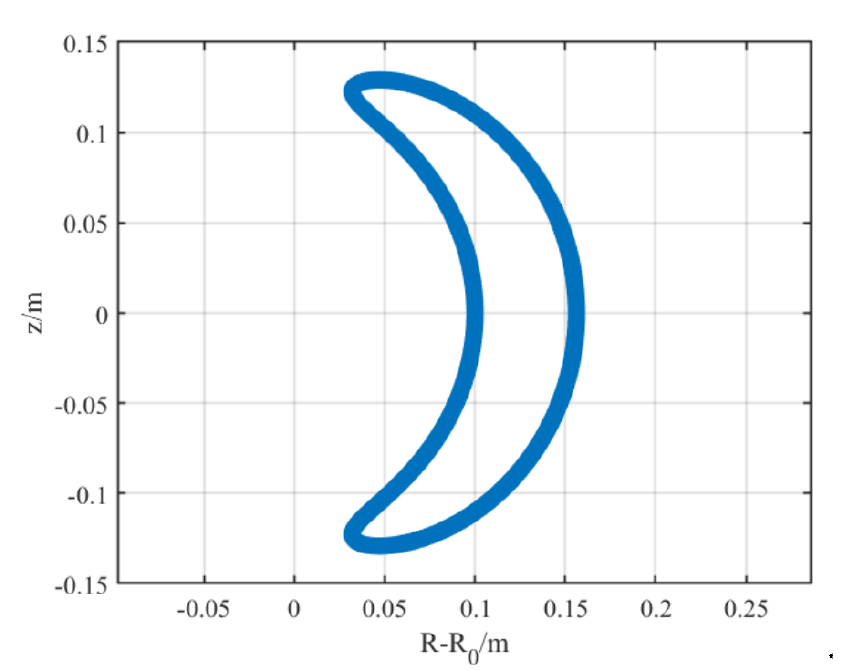

## Tokamak fields

$$\mathbf{B} = \boldsymbol{\nabla} \xi + \frac{r^2}{qR} \boldsymbol{\nabla}\theta,$$
where $q$ is safety factor.

Jacobian:
$$J = \boldsymbol{\nabla} \xi^1 \cdot \boldsymbol{\nabla} \xi^2 \times \boldsymbol{\nabla} \xi^3 = \frac{1}{\sqrt{g}}$$

Gradient:
$$\boldsymbol{\nabla} = \boldsymbol{\nabla} \xi^i \frac{\partial}{\partial \xi^i}$$

Divergence:
$$\boldsymbol{\nabla} \cdot \mathbf{A} = \frac{1}{\sqrt{g}} \frac{\partial}{\partial \xi^i} ( A^i \sqrt{g} )$$

Curl:  
If $\mathbf{B} = \boldsymbol{\nabla} \times \mathbf{A}$ then
$$B^i =  \frac{1}{\sqrt{g}} \epsilon^{ijk} \frac{\partial A_k}{\partial \xi^j}$$

$$\sin \zeta = -\frac{y}{R} \quad \cos \zeta = \frac{x}{R}$$

$$\begin{aligned}
  \hat{\zeta} = -\sin \zeta \hat{x} - \cos \zeta \hat{y}, \\
  \hat{\theta} = - \sin \theta \hat{R} + \cos \theta \hat{z}\\
  \hat{\mathbf{R}} = \cos \zeta \hat{x} - \sin \zeta \hat{y}.
\end{aligned}$$

From the above equations, it can be concluded that
$$\hat{\theta} = - \sin \theta \cos \zeta \hat{x} + \sin \theta \sin \zeta \hat{y} + \cos \theta \hat{z}.$$

## Relativistic volume-preserving algorithms

Relativistic volume-preserving algorithms in Julia.

## Runaway electron

Banana trajectory:


```julia
# PhysicalConstants
import PhysicalConstants.CODATA2018 as C
c = C.c_0.val
mₑ = C.m_e.val

# simulation parameters
Δt = 1.0e-1
N = 1 # number of particles
TotalSteps = 4000000 # total steps
SavePerNSteps = 10000 # Save 1000 steps

# tokamak parameters
B0 = 2.0 # Magnetic strength (T)
E0 = 2.0 # Electric strength (V/m)
R0 = 1.7 # Major radius of torus (m)
a  = 0.4 # Minor radius of torus (m)

# initial conditions
x0 = [1.8, 0, 0] # initial position (m)
unit_p= mₑ * c
p0 = [5, 1, 0]*unit_p # initial momentum (kg*m/s)

ptc_type=:electron # particle type

# pusher=:boris # pusher type
pusher=:RVPA_Cay3D
```

Passage particles:


# Ongoing work

Study full orbit 3.5 MeV alpha particles under the influence of electromagnetic perturbation of tearing mode in EAST and ITER using geometric algorithm such as relativistic volume preserving algorithm.

## EAST


## ITER


## Refs
- [1] T. Tajima and J. M. Dawson, Phys. Rev. Lett. 43, 267 (1979).
- [2] R. C. Davidson, Physics of Nonneutral Plasmas (Imperial College Press, London, 2001), p. 25.
- [3] R. D. Blandford and J. P. Ostriker, Astrophys. J. 221, L29 (1978).
- [4] J. Blake, D. Baker, N. Turner, K. Ogilvie, and R. Lepping, Geophys. Res. Lett. 24, 927, doi:10.1029/97GL00859 (1997).
- [5] D. Summers and R. M. Thorne, J. Geophys. Res. 108, 1143, doi:10.1029/ 2002JA009489 (2003).
- [6] J. V. Vay, Phys. Plasmas 15, 056701 (2008).
- [7] R. Friedel, G. Reeves, and T. Obara, J. Atmos. Sol. - Terr. Phys. 64, 265 (2002).
- [8] M. Honda, J. Meyer-ter-Vehn, and A. Pukhov, Phys. Rev. Lett. 85, 2128 (2000).
- [9] H. Knoepfel and D. A. Spong, Nucl. Fusion 19, 785 (1979).
- [10] C. K. Birdsall and A. B. Langdon, Plasma Physics via Computer Simulation (CRC Press, New York, 2004), p. 174.
- [11] J. Boris, in Proceedings of the Fourth Conference on the Numerical Simulation of Plasmas (Naval Research Laboratory, Washington, DC, 1970), pp. 3–67.
- [12] H. Qin, S. Zhang, J. Xiao, J. Liu, Y. Sun, and W. M. Tang, Phys. Plasmas 20, 084503 (2013).
- [13] Y. He, Y. Sun, J. Liu, and H. Qin, J. Comput. Phys. 281, 135 (2015).
- [14] K. Feng and M. Qin, The Symplectic Methods for the Computation of Hamiltonian Equations (Springer, Berlin, 1987).
- [15] Z. J. Shang, Numer. Math. 83, 477 (1999).
- [16] J. M. Finn and L. Chacon, Phys. Plasmas 12, 054503 (2005).
- [17] N. Crouseilles, M. Mehrenberger, and E. Sonnendr€ucker, J. Comput. Phys. 229, 1927 (2010).
- [18] M. Kraus, preprint arXiv:1307.5665 (2013).
- [19] H. Qin and X. Guan, Phys. Rev. Lett. 100, 035006 (2008).
- [20] K. Feng, in Proceedings of the 1st China-Japan Conference on Computation of Differential Equations and Dynamical Systems, Numerical Mathematics, edited by Z. Shi and T. Ushijima (World Scientific, 1993), pp. 1–28.
- [21] K. Feng and Z. Shang, Numer. Math. 71, 451 (1995).
- [22] R. I. McLachlan and G. R. W. Quispel, Acta Numer. 11, 341 (2002).
- [23] E. Hairer, C. Lubich, and G. Wanner, Geometric Numerical Integration: Structure-Preserving Algorithms for Ordinary Differential Equations (Springer, Berlin, 2006), Vol. 31, p. 128.
- [24] X. Guan, H. Qin, and N. J. Fisch, Phys. Plasmas 17, 092502 (2010).
- [25] J. R. Martın-Solıs, J. D. Alvarez, R. Sanchez, and B. Esposito, Phys. Plasmas 5, 2370 (1998).
- [26] J. R. Martın-Solıs, B. Esposito, R. Sanchez, and J. D. Alvarez, Phys. Plasmas 6, 238 (1999).
- [27] Physics of Plasmas 22, 044501 (2015) https://doi.org/10.1063/1.4916570
- [28] Phys. Plasmas 25, 022117 (2018); https://doi.org/10.1063/1.5012767
- [29] Physics of Plasmas 23, 092109 (2016) https://doi.org/10.1063/1.4962677
- [30] R. Zhang, J. Liu, H. Qin, Y. Wang, Y. He, and Y. Sun, Phys. Plasmas 22, 044501 (2015).
- [31] S. Blanes, F. Casas, and A. Murua, SIAM J. Sci. Comput. 27, 1817 (2006).
