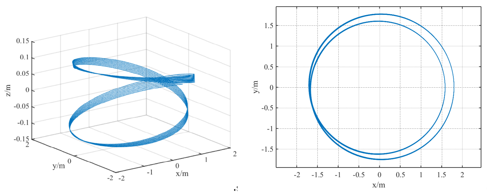
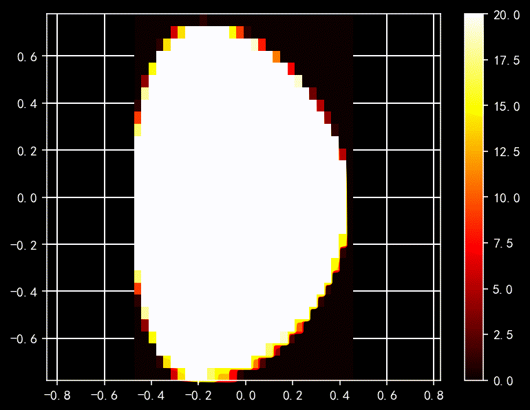
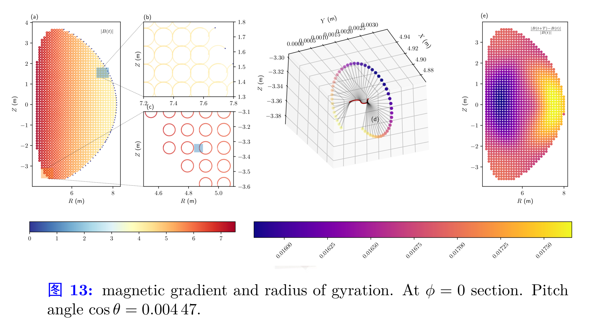

# Examples

## Banana trajectory


```julia
# PhysicalConstants
import PhysicalConstants.CODATA2018 as C
c = C.c_0.val
mₑ = C.m_e.val

# simulation parameters
Δt = 1.0e-1
N = 1 # number of particles
TotalSteps = 4000000 # total steps
SavePerNSteps = 10000 # Save 1000 steps

# tokamak parameters
B0 = 2.0 # Magnetic strength (T)
E0 = 2.0 # Electric strength (V/m)
R0 = 1.7 # Major radius of torus (m)
a  = 0.4 # Minor radius of torus (m)

# initial conditions
x0 = [1.8, 0, 0] # initial position (m)
unit_p= mₑ * c
p0 = [5, 1, 0]*unit_p # initial momentum (kg*m/s)

ptc_type=:electron # particle type

# pusher=:boris # pusher type
pusher=:RVPA_Cay3D
```

## Passage particles:


# Multiple Particles in Discrete Fields

## $\alpha$ particles loss in EAST



## $\alpha$ particles ITER

```julia
# simulation parameters
Δt = 0.1
N = 4 # number of particles
# TotalSteps = ceil(Int, 40000*2π) # total steps
TotalSteps = 400000
SavePerNSteps = 100 # Save 1000 steps

# tokamak parameters
B0 = 5.18 # Magnetic strength (T)
E0 = 2.0 # Electric strength (V/m)
R0 = 6.2 # Major radius of torus (m)
r_max  = 2.0 # Minor radius of torus (m)

u = Unit(B0, "alpha")
B0 /= u.B # Magnetic strength (T)
E0 /= u.E # Electric strength (V/m)
R0 /= u.x # Major radius of torus (m)
r_max /= u.x # Minor radius of torus (m)

# initial conditions
init_type = :parabolic_torus
μ = 1.000938997514917
σ = 0
sinθ_min = 0.0
sinθ_max = 1.0
ϕ_min=0.0
ϕ_max=2π

is_data_saving_on = false
is_merge_process_files_on = false


use_electric_field = true  # 控制是否使用电场的开关
ptc_type=:alpha # particle type

# pusher=:boris # pusher type
pusher=:RVPA_Cay3D
# pusher=:relativistic_boris_step
field=:discrete
```


